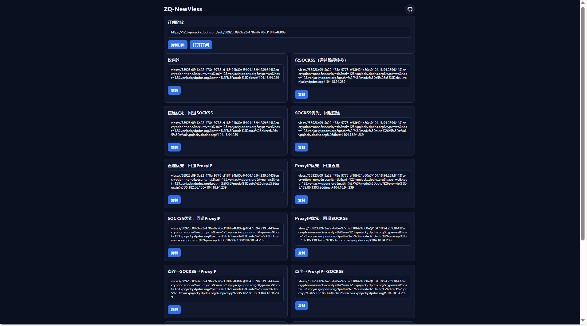
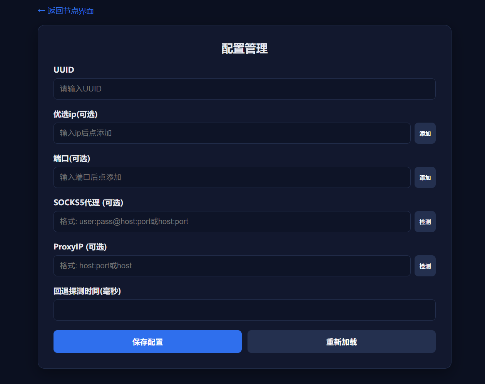
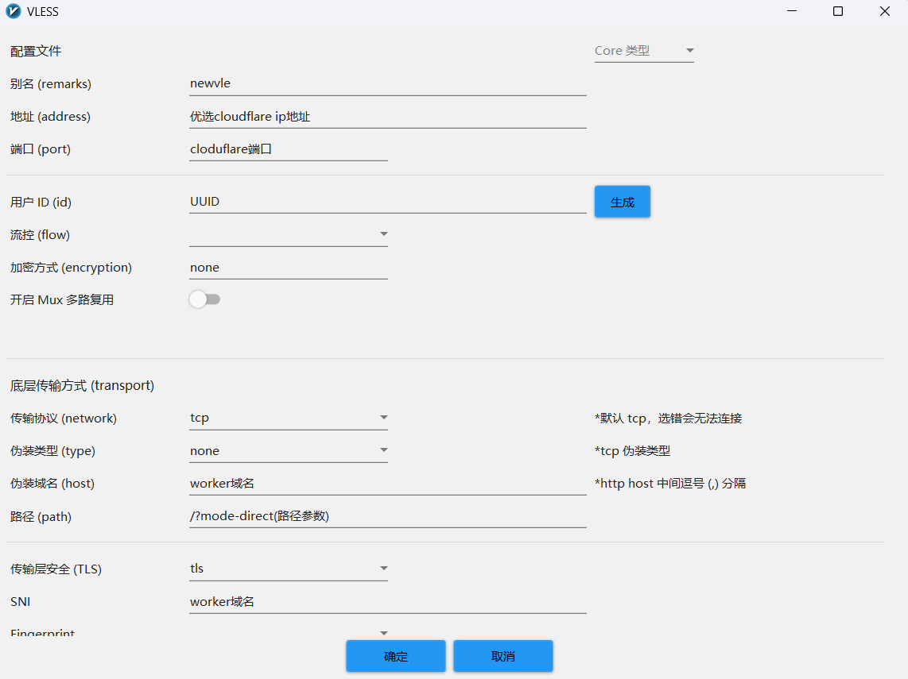
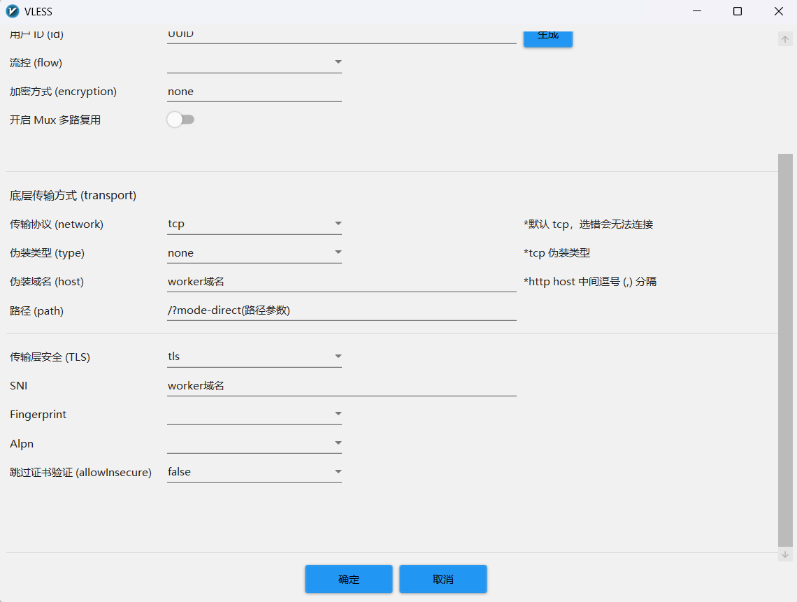

# ZQ-NewVless

## ✨ 功能特点

- 🚀 **多出站支持**：直连、SOCKS5代理、ProxyIP自动切换
- 🎛️ **Web配置管理**：通过Web界面管理所有配置，无需修改代码
- 🔒 **安全验证**：UUID验证确保只有授权用户能访问
- 📱 **响应式设计**：支持桌面和移动端访问
- 🌐 **优选工具集成**：内置优选域名,ProxyIP与订阅链接转换工具链接
- ⚡ **高性能**：基于Cloudflare Workers，全球加速

## 🚀 部署步骤

### 1. 准备工作

1. 注册 [Cloudflare](https://www.cloudflare.com/) 账号
2. 准备一个域名（可选，也可以使用Workers默认域名）

### 2. 创建Worker

1. 登录Cloudflare控制台
2. 点击左侧菜单 **Workers & Pages**
3. 点击 **创建应用程序**
4. 选择 **创建Worker**
5. 输入Worker名称
6. 点击 **创建Worker**

### 3. 配置代码

1. 在Worker编辑器中，删除默认代码
2. 复制 `_worker.js` 文件中的所有代码
3. 粘贴到编辑器中
4. 点击 **保存并部署**

### 3. 创建KV空间

1. 左侧菜单进入 **Workers & Pages → KV**（或在顶部搜索“KV”）
2. 点击 **创建命名空间**（Create namespace）
3. 为命名空间起一个名字`NewVless`
4. 点击 **创建**（Create） 完成

### 4. 绑定KV存储

1. 在Worker详情页面，点击 **设置** 标签
2. 找到 **变量** 部分，点击 **KV 命名空间绑定**
3. 点击 **添加绑定**
4. 设置：
   - **变量名称**：`NewVless`
   - **KV 命名空间**：选择你刚创建的命名空间
5. 点击 **保存**

## 📖 使用说明

### 首次使用

1. 访问你的Worker域名
2. 输入`ef9d104e-ca0e-4202-ba4b-a0afb969c747`进入节点界面
3. 点击右上角 **⚙️** 按钮进入配置管理
4. 配置你的代理设置：
   - **UUID**：强烈建议修改，用于身份验证
   - **优选域名**：可选，默认worker域名
   - **端口**：可选，默认443
   - **SOCKS5代理**：可选，格式 `user:pass@host:port`或者`host:port`
   - **ProxyIP**：可选，格式 `host:port`或者`host`
   - **回退检测时间**：可选，100-10000毫秒，默认1000(如果某个节点不通但是socks5或proxyip有效，可调节此值)

### 工具搭配

点击右上角 **🌐** 按钮可以访问优选域名和ProxyIP工具，帮助选择最适合你网络环境的配置。
点击右上角 **🔗** 按钮可以访问订阅链接转换工具，帮助适配不同客户端。(是放入节点信息里的内容而不是放入订阅链接或查看订阅里的内容)

## 手搓节点
路径参数

* `/?mode=direct`（仅直连）
* `/?mode=s5&s5=user:pass@host:port`（仅SOCKS5）
* `/?mode=auto&direct&s5=user:pass@host:port`（直连优先，回退SOCKS5）
* `/?mode=auto&s5=user:pass@host:port&direct`（SOCKS5优先，回退直连）
* `/?mode=auto&direct&proxyip=host:port`（直连优先，回退ProxyIP）
* `/?mode=auto&proxyip=host:port&direct`（ProxyIP优先，回退直连）
* `/?mode=auto&s5=user:pass@host:port&proxyip=host:port`（SOCKS5优先，回退ProxyIP）
* `/?mode=auto&proxyip=host:port&s5=user:pass@host:port`（ProxyIP优先，回退SOCKS5）
* `/?mode=auto&direct&s5=user:pass@host:port&proxyip=host:port`（三者：直连→SOCKS5→ProxyIP）
* `/?mode=auto&direct&proxyip=host:port&s5=user:pass@host:port`（三者：直连→ProxyIP→SOCKS5）
* `/?mode=auto&s5=user:pass@host:port&direct&proxyip=host:port`（三者：SOCKS5→直连→ProxyIP）
* `/?mode=auto&s5=user:pass@host:port&proxyip=host:port&direct`（三者：SOCKS5→ProxyIP→直连）
* `/?mode=auto&proxyip=host:port&direct&s5=user:pass@host:port`（三者：ProxyIP→直连→SOCKS5）
* `/?mode=auto&proxyip=host:port&s5=user:pass@host:port&direct`（三者：ProxyIP→SOCKS5→直连）

> 注意：不支持“仅 ProxyIP”模式

## 🤝 贡献

欢迎提交Issue和Pull Request！

## 🔗 相关链接

- [workers-vless](https://github.com/ymyuuu/workers-vless)
## ☕️ 请我喝杯奶茶

如果本项目对你有帮助，欢迎请我喝杯奶茶 

  

